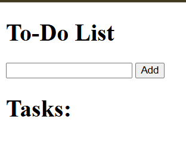
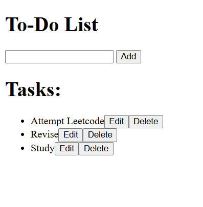
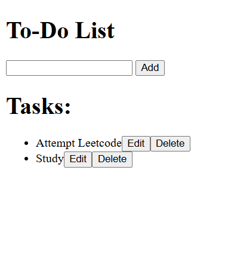
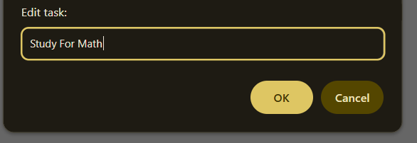
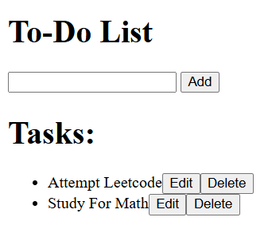

# A2SV WEB TRACK - To-Do List With TypeScript📝

Let's learn TypeScript. This is the first step to learning the awesome TypeScript language.

## Introduction

This is an extension to the to-do-js task.
In this task a simple To-Do list is created. It implements 3 Buttons ; Add, Edit and Delete.

## Learning Objectives :bookmark_tabs:

* How does TypeScript Work
* How does TypeScript Interfaces
* How to use with HTML
* How doe TypeScript Work functions and Types work

## Tasks :heavy_check_mark:

0. Create text input.
1. Implement Add button.
2. Implement Remove button.
3. Implement Edit Button.
4. Implement Edit functionality.
5. Input error handling.

## Results :chart_with_upwards_trend:

| Filename |
| ------ |
| [html](https://github.com/omphilejmatsobe/to-do-js/blob/master/index.html)|
| [typescript](https://github.com/omphilejmatsobe/to-do-js/blob/master/src/todo.ts)|

## ScreenShots :bookmark_tabs:

## Add:

## Delete:

## Edit:

